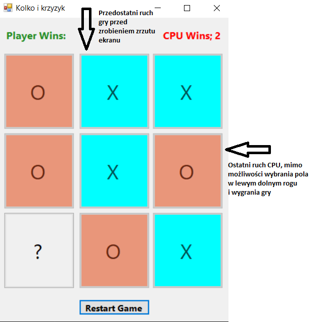
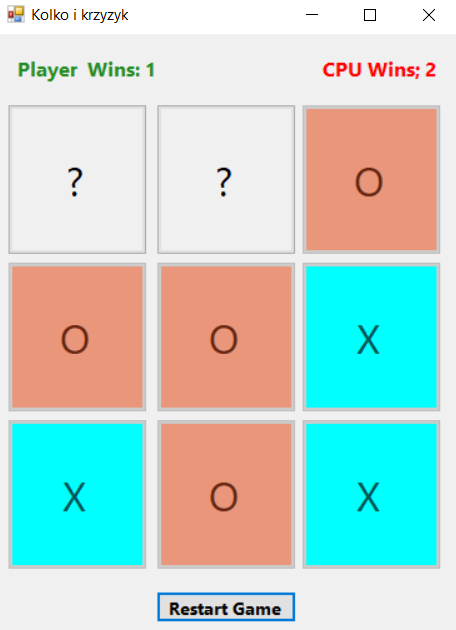

# Projekt - Kółko i krzyżyk
> Projekt został utworzony na podstawie umiejętności, które nabyliśmy na zajęciach.
Zdecydowaliśmy się je wykorzystać do utowrzenia interaktywnej gry w "kółko i krzyżyk".

## Spis Treści
* [Główne Informacje](#główne-informacje)
* [Funkcje](#funkcje)
* [Miejsce do poprawy](#miejsce-do-poprawy)
* [Zrzuty Ekranu](#zrzuty-ekranu)
* [Kontakt](#kontakt)
<!-- * [License](#license) -->

## Główne Informacje
- Projekt został wykonany w grupie dwuosobowej w skład, której wchodzą Klaudia Bojarska i Oliwier Maciejewski.
- Aplikacja pozwala na zagranie w grę "Kółko i krzyżyk"
- Projekt skierowany jest do osób, które szukają interaktywnej aplikacji, w którą mogą zagrać.

## Funkcje
- przycisk do zresetowania gry, pozwala na całkowite zresetowanie planszy do gry w przypadku popełnionego błędu
- licznik wygranych zarówno gracza jak i komputera
- kolory pól, które łatwo pozwalają określić jakie pola należą do gracza, a które do komputera
- pole, które pokazuje komunikat o zwycięstwie

## Miejsce do poprawy
Są pewne elementy które można poprawić w projekcie np.

- dopisać kod, który narzucałby CPU aby wybierał pola, które pozwolą mu na wygraną.
Czasami, gdy jest już jedno pole od wygranej nie wybiera go.

- można także udoskonalić wygląd okna do gry aby był bardziej nowoczesny.

## Zrzuty Ekranu

## Kontakt
W razie pytań prosimy o kontakt na maila k.bojarska.991@studms.ug.edu.pl lub o.maciejewski.007@studms.ug.edu.pl

<!-- Optional -->
<!-- ## License -->
<!-- This project is open source and available under the [... License](). -->

<!-- You don't have to include all sections - just the one's relevant to your project -->
