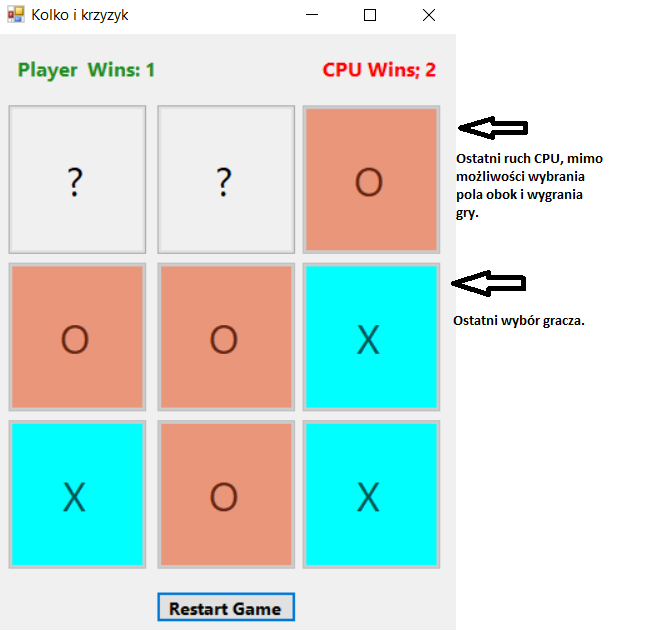

# Projekt - Kółko i krzyżyk
> Outline a brief description of your project.
> Live demo [_here_](https://www.example.com). <!-- If you have the project hosted somewhere, include the link here. -->

## Spis Treści
* [Główne Informacje](#główne-informacje)
* [Features](#features)
* [Setup](#setup)
* [Usage](#usage)
* [Miejsce do poprawy](#miejsce-do-poprawy)
* [Zrzuty Ekranu](#zrzuty-ekranu)
* [Inspiracja](#inspiracja)
* [Kontakt](#kontakt)
<!-- * [License](#license) -->

## Główne Informacje
- Projekt został wykonany w grupie dwuosobowej w skład, której wchodzą Klaudia Bojarska i Oliwier Maciejewski.
- Naszym celem było stworzenie popularnej gry "kółko i krzyżyk", którą bardzo lubimy.

## Features
List the ready features here:
- Awesome feature 1
- Awesome feature 2
- Awesome feature 3

## Setup
What are the project requirements/dependencies? Where are they listed? A requirements.txt or a Pipfile.lock file perhaps? Where is it located?

Proceed to describe how to install / setup one's local environment / get started with the project.

## Usage
How does one go about using it?
Provide various use cases and code examples here.

`write-your-code-here`

## Miejsce do porpawy
Są pewne elementy które można poprawić w projekcie np.

- dopisać kod, który narzucałby CPU aby wybierał pola, które pozwolą mu na wygraną.
Czasami, gdy jest już jedno pole od wygranej nie wybiera go.

## Zrzuty Ekranu

## Inspiracja
Give credit here.
- This project was inspired by...
- This project was based on [this tutorial](https://www.example.com).
- Many thanks to...

## Kontakt
W razie pytań prosimy o kontakt na maila k.bojarska.991@studms.ug.edu.pl lub o.maciejewski.007@studms.ug.edu.pl

<!-- Optional -->
<!-- ## License -->
<!-- This project is open source and available under the [... License](). -->

<!-- You don't have to include all sections - just the one's relevant to your project -->
